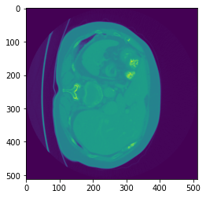
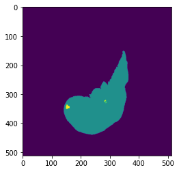
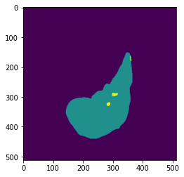

# Liver and Tumor Segmentation for CT Images with U-Net
This repo mains the project I did for MIT 6.869 Spring 2022, which is medical segmentation of liver and tumor.

### Method

* **Network structure**: U-Net with 16 features on the first layer. Optimizer was Adam. Loss function was crossEntropy
* **Data set**: liver data set from *Medical Segmentation Decathlon*. I sliced the 3-D CT images into 3-channel 2-D images for training and validation.
* An experimental idea of fusing the prediction labels along the three directions.

### Result

|  |  |  |  |
| ------------------------ | ------------------------ | ----------------------- | ------------------------- |
| CT image                 | True label               | Prediction              | Fused prediction          |

### How to use

* **segmentation.ipynb** contains the main code for training and visualization
* **helper_function_seg.ipynb** has some helper functions (for data preparation, generating images for the report, display 3D image as gif)
* **models/** contains the trained model.
* **videos/** contains the test results on a CT image (see details [here](videos/readme.md)).

